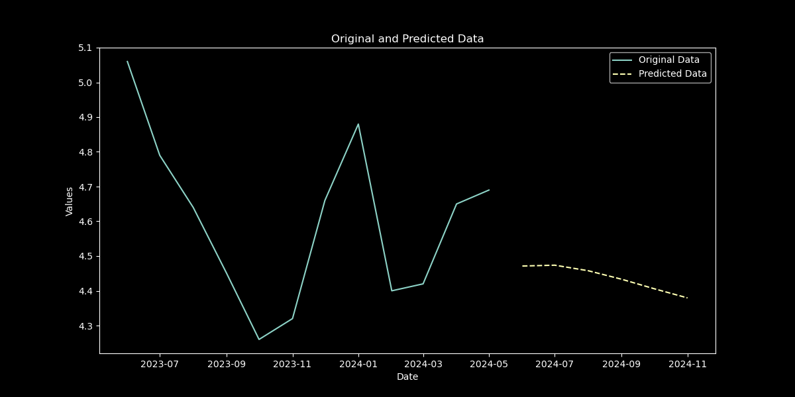
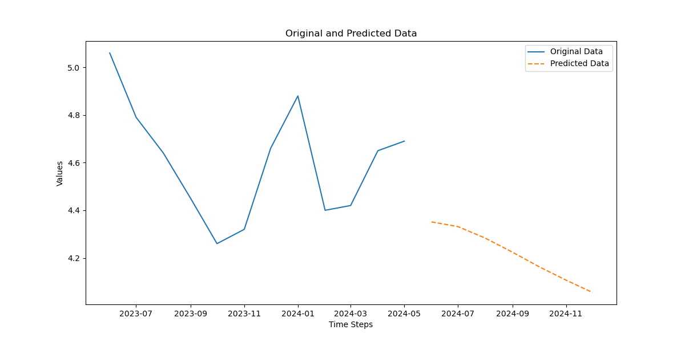

## Time Series Inflation Model for Mexico

This project focuses on building a time series model to analyze and predict the inflation rate in Mexico. The model is constructed using PyTorch for its deep learning capabilities, while PyTorch Lightning is employed to eliminate boilerplate code, enhancing code readability and maintainability.

### Features

- **Time Series Analysis**: Leverage historical inflation data to make future predictions.
- **Deep Learning**: Utilize PyTorch for powerful and flexible model building.
- **Simplified Codebase**: PyTorch Lightning is used to streamline the code and reduce redundancy.

### Installation

1. Clone the repository:
   ```bash
   git clone https://github.com/yourusername/inflation-mexico-model.git


### Compare results

- **Results of the predictions using Pytorch**: 



- **Results of the predictions using Pytorch + Lightning**




